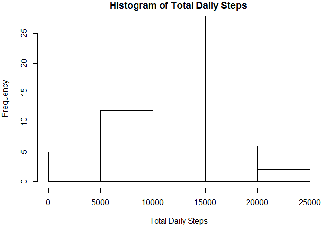
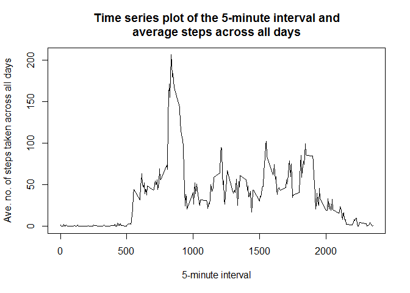
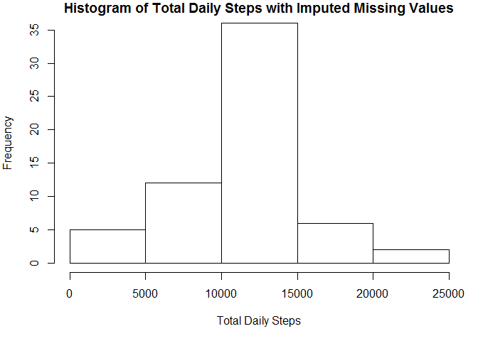
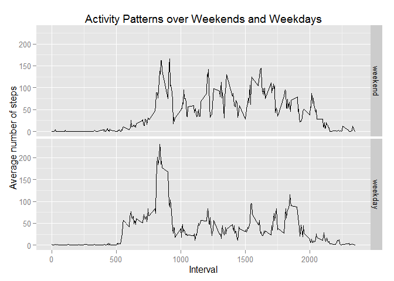

# Reproducible Research: Peer Assessment 1
Rajesh Bhagat  


## Loading and preprocessing the data

```r
data <- read.csv("C:\\Users\\rmbhagat\\Desktop\\Coursera\\R\\Exercises\\5_ReproducibleReports\\RepData_PeerAssessment1\\activity\\activity.csv")
```


## What is mean total number of steps taken per day?

```r
totalDailySteps <- tapply(data$steps, data$date, sum)
```

```r
par(mar=c(5,4,1,1))
hist(totalDailySteps, main="Histogram of Total Daily Steps", xlab = "Total Daily Steps")
```

 

```r
totalDailyStepsMean <- mean(totalDailySteps, na.rm=TRUE)
totalDailyStepsMedian <- median(totalDailySteps, na.rm=TRUE)
```
The mean number of steps per day is 1.0766189\times 10^{4}.
The median number of steps per day is 10765.

## What is the average daily activity pattern?

```r
dataAve5Int <- tapply(data$steps, data$interval, mean, na.rm=TRUE)
plot(names(dataAve5Int),dataAve5Int,type="l", xlab = "5-minute interval", ylab = "Ave. no. of steps taken across all days", main = " Time series plot of the 5-minute interval and \naverage steps across all days")
```

 

```r
nameIntervalMaxAve <- names(dataAve5Int[dataAve5Int==max(dataAve5Int)])
maxValue <- round(max(dataAve5Int))
```
5-minute interval, on average across all the days in the dataset, which contains the maximum number of steps is 835

The maximum value at this interval is 206

## Imputing missing values

```r
totalNAs <- sum(is.na(data$steps))
```
Total number of missing values is 2304


```r
dataCopy <- data

#check for na in steps variable
stepsNa <- is.na(dataCopy$steps)

#work out the average number of steps / interval
ave_interval <- tapply(dataCopy$steps,dataCopy$interval,mean, na.rm = TRUE, simplify = TRUE)

#substitute the average interval values into dataCopy data frame
dataCopy$steps[stepsNa] <- ave_interval[as.character(dataCopy$interval[stepsNa])]
```


```r
dataImputed <- tapply(dataCopy$steps, dataCopy$date, sum)
```

```r
par(mar=c(5,4,1,1))
hist(dataImputed,main="Histogram of Total Daily Steps with Imputed Missing Values", xlab = "Total Daily Steps")
```

 

```r
dataImputedMean <- mean(dataImputed, na.rm=TRUE)
dataImputedMedian <- median(dataImputed, na.rm=TRUE)
```

The mean total number of steps taken per day is 1.0766189\times 10^{4}. <br/>
The median total number of steps taken per day is 1.0766189\times 10^{4}.


## Are there differences in activity patterns between weekdays and weekends?


```r
dataCopy2 <- dataCopy
dataCopy2$date <- as.Date(dataCopy2$date)

#create a vector of weekdays
weekdays1 <- c('Monday', 'Tuesday', 'Wednesday', 'Thursday', 'Friday')

dataCopy2$wDay <- factor( (weekdays(dataCopy2$date) %in% weekdays1), levels=c(FALSE, TRUE), labels=c('weekend', 'weekday'))

activityPattern <- with(dataCopy2,aggregate(steps ~ interval + wDay, FUN = "mean"))

library(ggplot2)
g <- ggplot(activityPattern, aes(interval, steps)) + geom_line()
g + facet_grid(wDay ~ .) + labs(x = "Interval") + labs(y = "Average number of steps") + labs(title = "Activity Patterns over Weekends and Weekdays")
```

 


The panel plots show that activity over weekdays is concentrated around a few intervals, probably because people are working, while weekend activity is spread out throughout the day since people are not working.
