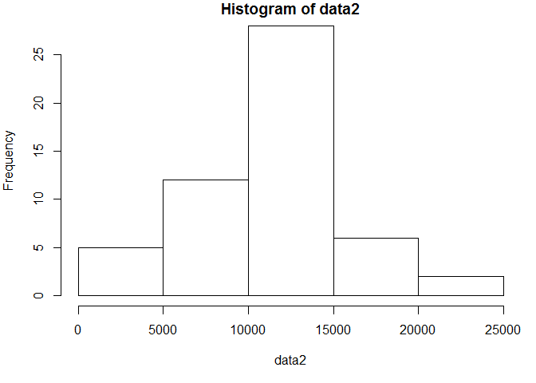
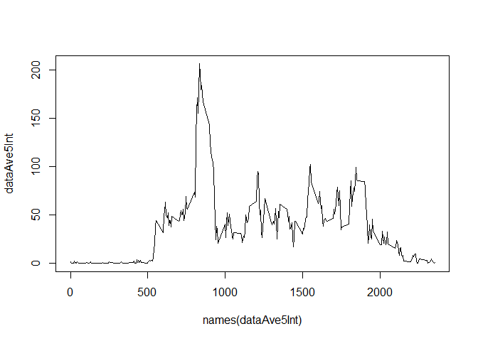
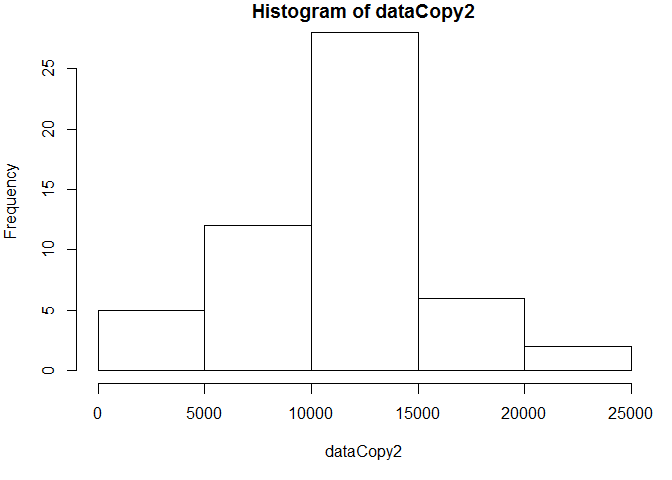

# Reproducible Research: Peer Assessment 1


## Loading and preprocessing the data

```r
data <- read.csv("C:\\Users\\rmbhagat\\Desktop\\Coursera\\R\\Exercises\\5_ReproducibleReports\\RepData_PeerAssessment1\\activity\\activity.csv")
```


## What is mean total number of steps taken per day?

```r
data2 <- tapply(data$steps, data$date, sum)
```

```r
par(mar=c(5,4,1,1))
hist(data2)
```

 

```r
data2mean <- mean(data2, na.rm=TRUE)
data2median <- median(data2, na.rm=TRUE)
```
The mean number of steps per day is 1.0766189\times 10^{4}.
The median number of steps per day is 10765.

## What is the average daily activity pattern?

```r
dataAve5Int <- tapply(data$steps, data$interval, mean, na.rm=TRUE)
plot(names(dataAve5Int),dataAve5Int,type="l")
```

 

```r
nameIntervalMaxAve <- names(dataAve5Int[dataAve5Int==max(dataAve5Int)])
```
5-minute interval, on average across all the days in the dataset, which contains the maximum number of steps is 835


## Imputing missing values

```r
totalNAs <- sum(is.na(data$steps))
```
Total number of missing values is 2304


```r
dataCopy <- data
library(plyr)
impute.mean <- function(x) replace(x, is.na(x), mean(x, na.rm = TRUE))
ddply(dataCopy, .(as.character(date)), transform, steps = impute.mean(steps))
```


```r
dataCopy2 <- tapply(dataCopy$steps, dataCopy$date, sum)
```

```r
par(mar=c(5,4,1,1))
hist(dataCopy2)
```

 

```r
dataCopy2mean <- mean(dataCopy2, na.rm=TRUE)
dataCopy2median <- median(dataCopy2, na.rm=TRUE)
```

The mean total number of steps taken per day is 1.0766189\times 10^{4}. <br/>
The median total number of steps taken per day is 10765.


## Are there differences in activity patterns between weekdays and weekends?
